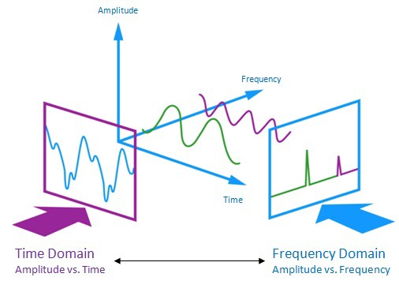

# Emotion Detection from Audio and Text using Multi-Model Approach

## Abstract

Emotional Detection is a way of converting the audio file that contain
various emotional labels such as happy, anger, sad, disgust, fear. And
converting them to a matrix array through feature engineering techniques
backed by various algorithms such as Zero Crossing Rate, Chroma Shift,
MFCC (Mel Frequency Cepstral Coefficients) and treating the Audio
components as an Image to our Models and employing un-supervised
learning methodologies to cluster the emotions is the motive of our
project.

## Dataset

We are using various open-source datasets for this problem: 
| CREMA-D | [Crowd-Sourced Emotional Multimodal Actors Dataset](https://www.ncbi.nlm.nih.gov/pmc/articles/PMC4313618/) | 7442 Audio Files and 6 Emotions  |
|---------|------------------------------------------------------------------------------------------------------------|----------------------------------|
| SAVEE   | [Surrey Audio-Visual Expressed Emotions](http://kahlan.eps.surrey.ac.uk/savee/)                            | 480 Audio Files and 7 Emotions   |
| TESS    | [Toronto Emotional Speech](https://tspace.library.utoronto.ca/handle/1807/24487)                           | 2,800 Audio Files and 7 Emotions |

**CREMA-D**, **SAVEE**, and **TESS**, are collections of audio files
that have been specifically curated for research related to emotional
speech and expression. Each of these datasets contains a variety of
emotional expressions recorded by actors or individuals, and they are
widely used in the fields of speech processing, emotion recognition, and
related research areas.

Exploratory Data Analysis\
To understand the distribution of data, we have done some data analysis
and visualization.

Here, we can see the distribution of emotions in each dataset and
distribution after combining all the datasets.

Sampling rate is one of the key elements
to bring all the audio files into same frequency, to know which
frequency to consider bringing all the audio files data into same
frequency, we visualized the sampling rate of all the audio files as you
can see in the Figure 1, the different sampling rates.

  
***Figure 1**: Figure Showing the Different Sampling Rate Distribution*

These are the sampling rates, and we can
see that most audio files has 16000 frequency, and one thing we observed
is all the CREMA-D has 16000 sampling rate, all SAVEE has 44100 sampling
rate,

except one audio file, all the other TESS has 24414 sampling rate, one
TESS file has 96000 sampling rate.\
So to generalize the data and make it easier for calculations, we
considered sampling rate of 16000.

While converting audio files to numerical features, the length of audio
plays a key role. While considering mel spectrogram images, if the
length of audio is less, we get the image dimensions will be less
compared to the audio with more length, to get a better understanding of
distribution, we plot the audio length histogram.

Here we can see that most of the audio files have
length between 2-4 seconds.

 
***Figure 3:** Shows the Different Wave components of an Audio File*

Audio files are based on 3 components: *Amplitude, Frequency and Time*
as stated in the above *figure 3*. The challenge here is that we cannot
input the audio files directly. The Feature Engineering part of the
dataset is where we transform the 3-component waveform that constitutes
an audio file, gets converted to a 3-dimensional matrix array. This 3-D
matrix array captures all the frequency and the waveform characteristics
of the dataset in a higher dimensional space. This higher dimensional
space matrix is then further refined by going through the dimensionality
reductions to preserve the components from higher order to a lower order
matrix and then we employ classification algorithms to classify the
emotions.

To convert audio data into numerical we approached multitude of feature
engineering algorithms to de-compose the audio waveforms and we
inspected each algorithm which best suits our purpose of feature
engineering. The feature engineering algorithms we used are *Zero
Crossing Rate (ZCR)*, *Chroma Shift*, *MFCC*, *Mel-Spectrogram*.
